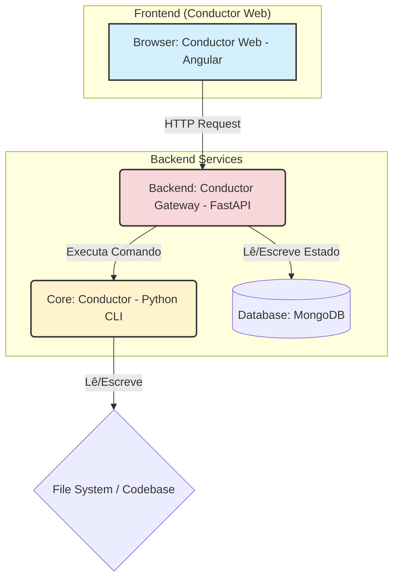

# 📐 Arquitetura da Solução: Documentos Vivos

Este documento detalha a arquitetura técnica por trás do sistema "Documentos Vivos" implementado no **Conductor Web**.

## 1. Diagrama de Alto Nível

O sistema é composto por três componentes principais que trabalham em conjunto:



-   **Conductor Web:** A interface do usuário onde o documento é visualizado e interagido. Responsável pela camada visual e pela captura de intenção do usuário.
-   **Conductor Gateway:** Um serviço de API que atua como uma ponte segura entre o front-end e o sistema principal. Ele gerencia as requisições, o estado e a comunicação com o Conductor.
-   **Conductor:** O motor principal de agentes de IA, que executa as tarefas no código-fonte.
-   **MongoDB:** O banco de dados onde o estado de cada instância de agente é armazenado de forma persistente.

## 2. O Ciclo de Vida da Âncora de Agente

O coração da arquitetura é o ciclo de vida de uma "âncora", o vínculo entre o texto e o estado do agente.

1.  **Carregamento e "Aumentação":**
    a. O Conductor Web carrega um arquivo `.md` do disco.
    b. Uma função de sincronização escaneia o texto em busca de emojis de agente (ex: `🚀`) que **não** possuem uma âncora de comentário.
    c. Para cada emoji "órfão" encontrado, o sistema:
        i. Gera um Identificador Universalmente Único (UUID v4).
        ii. Cria um novo registro no MongoDB usando este UUID como `_id`. O registro armazena o tipo de agente, status (`pending`), etc.
        iii. Injeta a âncora no texto em memória, na forma de um comentário HTML: `<!-- agent-id: {uuid} -->🚀`.

2.  **Renderização:**
    a. A aplicação renderiza a camada interativa, criando um componente "agente rico" (círculo clicável) para cada agente encontrado no estado interno (que foi populado no passo anterior).
    b. A aparência do agente rico (cor, ícone) reflete seu `status` recuperado do MongoDB.

3.  **Salvamento:**
    a. Quando o usuário salva o documento, a aplicação primeiro converte o estado atual do editor (HTML) de volta para Markdown puro.
    b. Em seguida, ela garante que todas as âncoras de comentário `<!-- agent-id: ... -->` estão presentes no texto final.
    c. O arquivo `.md` enriquecido com as âncoras é salvo no disco.

4.  **Recarregamento:**
    a. Ao carregar um arquivo `.md` que já contém âncoras, o processo é mais simples.
    b. A função de sincronização lê os UUIDs diretamente dos comentários.
    c. Para cada UUID, ela consulta o MongoDB para recuperar o estado mais recente do agente.
    d. A camada interativa é reconstruída com base nos dados recuperados, restaurando perfeitamente o estado anterior.

## 3. Modelo de Dados

A persistência do estado é gerenciada através de múltiplas estruturas de documento no MongoDB.

### 3.1 Coleção: `agent_instances`

```typescript
// Interface que representa o documento no MongoDB
interface AgentInstance {
  _id: string; // O UUID da âncora
  agent_id?: string; // ID do agente no backend
  conversation_id?: string; // Vincula instância a uma conversa
  documentPath: string; // O caminho do arquivo .md ao qual pertence
  agentType: string; // O tipo de agente do Conductor (ex: 'CodeGenerator_Agent')
  emoji: string; // Representação visual (🚀, 🔐, etc)
  status: 'pending' | 'queued' | 'in_progress' | 'running' | 'completed' | 'error';
  position: {
    x: number;
    y: number;
  };
  config?: {
    cwd?: string; // Working directory
    createdAt?: Date;
    updatedAt?: Date;
  };
  lastRunTimestamp?: Date;
  contextSummary: string; // Um resumo do texto ao redor da âncora
  results?: {
    filesCreated?: string[];
    summary?: string;
    logs?: string;
  };
}
```

### 3.2 Coleção: `conversations`

```typescript
// Conversa com histórico persistente
interface Conversation {
  _id: string; // conversation_id (UUID)
  screenplay_id?: string; // Vincula a um screenplay
  title: string; // Título editável
  context?: string; // Contexto markdown editável
  created_at: Date;
  updated_at: Date;
  active_agent?: {
    agent_id: string;
    instance_id: string;
    name: string;
    emoji?: string;
  };
  participants: Array<{
    agent_id: string;
    instance_id: string;
    name: string;
    emoji?: string;
  }>;
}
```

### 3.3 Coleção: `messages`

```typescript
// Mensagens de uma conversa
interface Message {
  _id: string; // message_id (UUID)
  conversation_id: string; // FK para conversations
  type: 'user' | 'bot' | 'system';
  content: string; // Texto da mensagem
  timestamp: Date;
  isDeleted?: boolean; // Soft delete flag
  agent?: {
    agent_id: string;
    instance_id: string;
    name: string;
    emoji?: string;
  }; // Presente apenas em mensagens de bot
}
```

### 3.4 Coleção: `tasks` (Backend)

```typescript
// Tarefas executadas por agentes
interface TaskDetails {
  _id: string; // task_id
  agent_id: string;
  agent_name: string;
  agent_emoji: string;
  prompt: string | null;
  result: string | null; // Markdown
  status: string;
  severity: 'info' | 'warning' | 'error';
  created_at: Date;
  completed_at: Date;
  duration: number; // Em segundos
  error: string | null;
  is_councilor: boolean; // Se é um councilor (meta-agente)
}
```

### 3.5 Modelo de Eventos de Gamificação

```typescript
// Eventos para sistema de gamificação
interface GamificationEvent {
  id: string; // execution_id ou gerado localmente
  title: string;
  severity: 'info' | 'warning' | 'error';
  timestamp: number; // Unix timestamp
  meta?: Record<string, unknown>;
  category?: 'build' | 'critical' | 'analysis' | 'success' | 'alert';
  level?: 'debug' | 'info' | 'result';
  summary?: string;
  agentEmoji?: string;
  agentName?: string;
}
```

## 4. Camada de Serviços (Frontend)

### 4.1 Serviços de Domínio

-   **ConversationService**: CRUD de conversas e mensagens via API REST
    -   `createConversation()`, `getConversation()`, `updateConversation()`, `deleteConversation()`
    -   `sendMessage()`, `deleteMessage()`
    -   `setActiveAgent()`

-   **ScreenplayService**: Gerenciamento de screenplays e sincronização com disco
    -   `loadScreenplay()`, `saveScreenplay()`, `reloadFromDisk()`
    -   Sincronização bidirecional entre editor e filesystem

-   **GamificationEventsService**: Sistema híbrido de eventos
    -   WebSocket primário para eventos em tempo real
    -   Polling de métricas como fallback
    -   `loadHistoricalEvents()` para carregar últimos 50 eventos
    -   Observable `events$` para subscrição

-   **SpeechRecognitionService**: Integração com Web Speech API
    -   `startRecording()`, `stopRecording()`, `toggleRecording()`
    -   Observable `transcript$` para emitir transcrições

-   **AgentMetricsService**: Polling de métricas de execução
    -   Consulta periódica a `/api/agents/metrics`
    -   Observables para contadores de execução

### 4.2 Componentes Principais

-   **ScreenplayInteractive** (`screenplay-interactive.ts`)
    -   Gerencia instâncias de agentes e conversas
    -   Sincronização com disco via File System Access API
    -   Propagação de working directory

-   **ConductorChatComponent**
    -   Interface de chat unificada
    -   Suporte a múltiplos agentes
    -   Integração com voice input
    -   Sistema de deleção com rollback

-   **ConversationListComponent**
    -   Sidebar para navegação
    -   Drag & drop para reordenar
    -   Edição de título e contexto
    -   Exibição de meta-informações

-   **ReportModalComponent**
    -   Interface com abas (Resultado/Prompt/JSON)
    -   Carregamento de detalhes via task ID
    -   Renderização de markdown

-   **GamifiedPanelComponent**
    -   Painel de gamificação
    -   Ticker de eventos em tempo real
    -   Categorização visual por severidade

## 5. Fluxos de Comunicação

### 5.1 Fluxo de Envio de Mensagem

```
User Input (TipTap Editor)
  ↓
ConductorChatComponent.sendMessage()
  ↓
ConversationService.sendMessage()
  ↓
POST /api/conversations/{id}/messages
  ↓
Backend processa e executa agente
  ↓
WebSocket emite evento de conclusão
  ↓
GamificationEventsService captura evento
  ↓
UI atualiza com resposta do agente
```

### 5.2 Fluxo de Deleção de Mensagem

```
User clica botão deletar
  ↓
ChatMessagesComponent.onDeleteMessage()
  ↓
Atualização otimista: marca isDeleted = true
  ↓
ConversationService.deleteMessage()
  ↓
PUT /api/conversations/{id}/messages/{msg_id}/delete
  ↓
Se erro: rollback (isDeleted = false)
Se sucesso: mantém estado deletado
```

### 5.3 Fluxo de Eventos de Gamificação

```
Backend executa agente
  ↓
Emite evento via WebSocket
  ↓
GamificationWebSocketService recebe
  ↓
Mapeia para GamificationEvent local
  ↓
GamificationEventsService.addEvent()
  ↓
events$ Observable emite novo evento
  ↓
EventTickerComponent renderiza
```

Esta arquitetura garante um sistema robusto e escalável, onde a simplicidade do Markdown é preservada enquanto se habilita uma camada poderosa e persistente de interatividade com IA, suportada por comunicação em tempo real e gestão complexa de estado.
