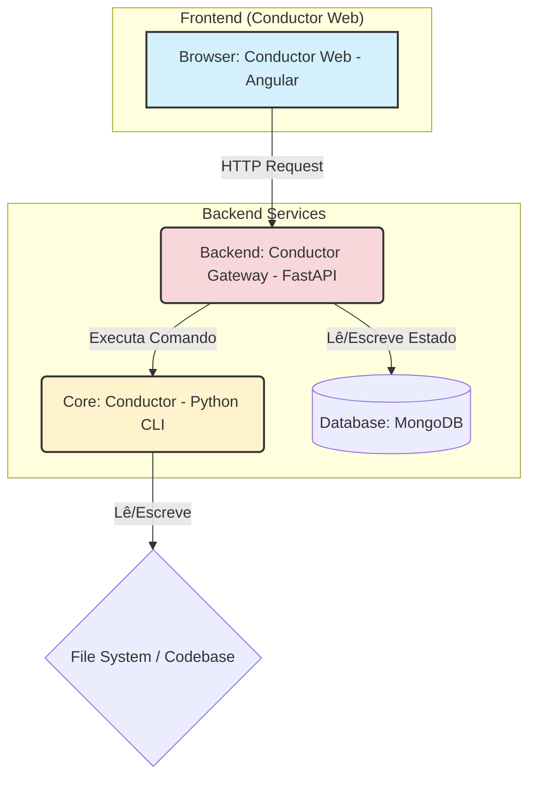

# 📐 Arquitetura da Solução: Documentos Vivos

Este documento detalha a arquitetura técnica por trás do sistema "Documentos Vivos" implementado no **Conductor Web**.

## 1. Diagrama de Alto Nível

O sistema é composto por três componentes principais que trabalham em conjunto:



-   **Conductor Web:** A interface do usuário onde o documento é visualizado e interagido. Responsável pela camada visual e pela captura de intenção do usuário.
-   **Conductor Gateway:** Um serviço de API que atua como uma ponte segura entre o front-end e o sistema principal. Ele gerencia as requisições, o estado e a comunicação com o Conductor.
-   **Conductor:** O motor principal de agentes de IA, que executa as tarefas no código-fonte.
-   **MongoDB:** O banco de dados onde o estado de cada instância de agente é armazenado de forma persistente.

## 2. O Ciclo de Vida da Âncora de Agente

O coração da arquitetura é o ciclo de vida de uma "âncora", o vínculo entre o texto e o estado do agente.

1.  **Carregamento e "Aumentação":**
    a. O Conductor Web carrega um arquivo `.md` do disco.
    b. Uma função de sincronização escaneia o texto em busca de emojis de agente (ex: `🚀`) que **não** possuem uma âncora de comentário.
    c. Para cada emoji "órfão" encontrado, o sistema:
        i. Gera um Identificador Universalmente Único (UUID v4).
        ii. Cria um novo registro no MongoDB usando este UUID como `_id`. O registro armazena o tipo de agente, status (`pending`), etc.
        iii. Injeta a âncora no texto em memória, na forma de um comentário HTML: `<!-- agent-id: {uuid} -->🚀`.

2.  **Renderização:**
    a. A aplicação renderiza a camada interativa, criando um componente "agente rico" (círculo clicável) para cada agente encontrado no estado interno (que foi populado no passo anterior).
    b. A aparência do agente rico (cor, ícone) reflete seu `status` recuperado do MongoDB.

3.  **Salvamento:**
    a. Quando o usuário salva o documento, a aplicação primeiro converte o estado atual do editor (HTML) de volta para Markdown puro.
    b. Em seguida, ela garante que todas as âncoras de comentário `<!-- agent-id: ... -->` estão presentes no texto final.
    c. O arquivo `.md` enriquecido com as âncoras é salvo no disco.

4.  **Recarregamento:**
    a. Ao carregar um arquivo `.md` que já contém âncoras, o processo é mais simples.
    b. A função de sincronização lê os UUIDs diretamente dos comentários.
    c. Para cada UUID, ela consulta o MongoDB para recuperar o estado mais recente do agente.
    d. A camada interativa é reconstruída com base nos dados recuperados, restaurando perfeitamente o estado anterior.

## 3. Modelo de Dados

A persistência do estado é gerenciada através da seguinte estrutura de documento no MongoDB, dentro de uma coleção `agent_instances`.

```typescript
// Interface que representa o documento no MongoDB
interface AgentInstance {
  _id: string; // O UUID da âncora
  documentPath: string; // O caminho do arquivo .md ao qual pertence
  agentType: string; // O tipo de agente do Conductor a ser invocado (ex: 'CodeGenerator_Agent')
  status: 'pending' | 'in_progress' | 'completed' | 'error';
  lastRunTimestamp?: Date;
  contextSummary: string; // Um resumo do texto ao redor da âncora
  results: {
    // Armazena o resultado da execução
    filesCreated?: string[];
    summary?: string;
    logs?: string;
  };
}
```

Esta arquitetura garante um sistema robusto, onde a simplicidade do Markdown é preservada enquanto se habilita uma camada poderosa e persistente de interatividade com IA.
