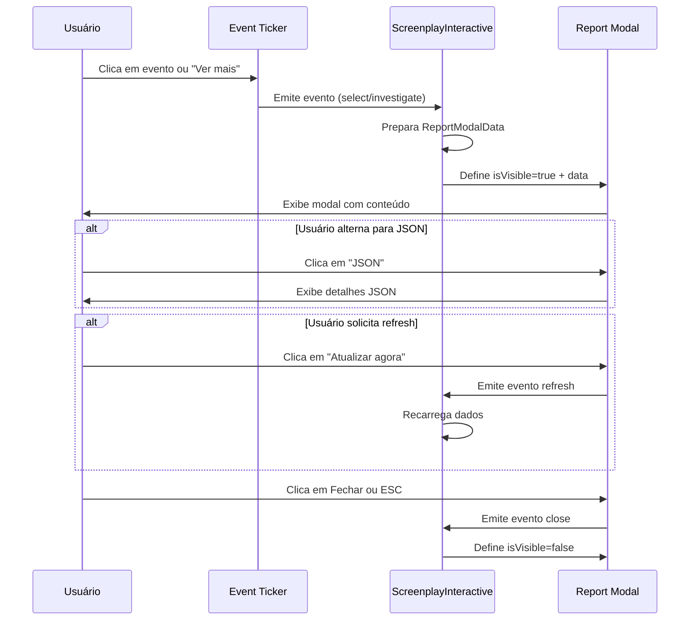
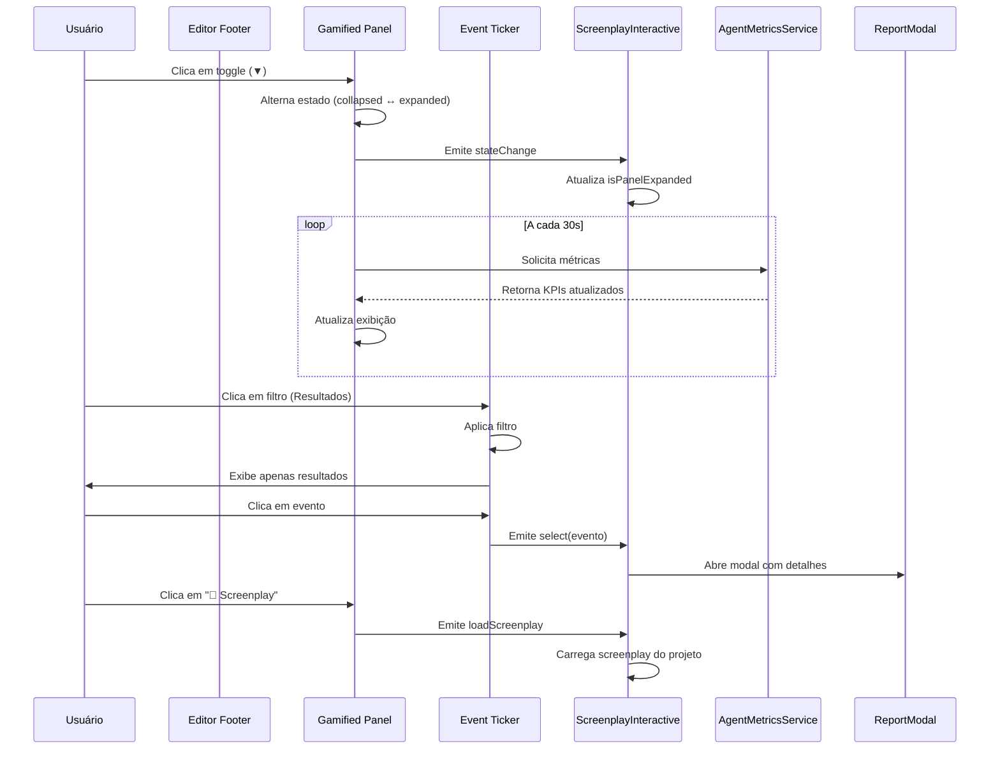

# Plano de Avaliação de Funcionalidades: Report Modal e Editor Footer

**Data:** 04/11/2025
**Versão:** 1.0
**Autor:** Análise Técnica do Sistema

---

## 1. Visão Geral

Este documento apresenta uma avaliação completa de duas funcionalidades principais do sistema Living Screenplay:

1. **Report Modal** (`class="modal-content report-modal"`)
2. **Editor Footer** (`class="editor-footer"`)

O objetivo é documentar o funcionamento completo, requisitos, dependências e fluxos de uso dessas funcionalidades para facilitar manutenção, evolução e compreensão do sistema.

---

## 2. Funcionalidade: Report Modal

### 2.1. Localização no Código

**Arquivos principais:**
- `src/app/living-screenplay-simple/report-modal/report-modal.component.ts` (linhas 1-135)
- `src/app/living-screenplay-simple/screenplay-interactive.html` (linhas 396-402)
- `src/app/living-screenplay-simple/screenplay-interactive.ts` (linhas 28, 128, 235-237)

### 2.2. Descrição Funcional

O Report Modal é um componente modal responsável por exibir relatórios e detalhes de eventos do sistema de gamificação e execução de agentes. Ele apresenta informações estruturadas sobre eventos, resultados de agentes e notificações do sistema.

### 2.3. Estrutura de Dados

#### Interface `ReportModalData`
```typescript
export interface ReportModalData {
  title: string;                              // Título do relatório
  timestamp?: number;                         // Timestamp do evento
  severity?: 'info' | 'warning' | 'error';   // Nível de severidade
  details?: Record<string, unknown> | null;   // Detalhes em JSON
  summary?: string | null;                    // Resumo em Markdown
}
```

### 2.4. Funcionalidades Principais

#### 2.4.1. Exibição de Conteúdo
- **Modo Markdown**: Renderiza conteúdo usando a biblioteca `marked`
- **Modo JSON**: Exibe detalhes técnicos em formato JSON formatado
- **Toggle entre modos**: Botão para alternar entre visualização Markdown e JSON

#### 2.4.2. Recursos de Interação
- **Fechar modal**: Botão X e clique no overlay (evento ESC também fecha)
- **Atualizar agora**: Botão para forçar refresh dos dados
- **Indicador de severidade**: Ícones visuais para info (ℹ️), warning (⚠️), error (⛔)
- **Timestamp relativo**: Exibe tempo decorrido em formato amigável (s, m, h, d)

#### 2.4.3. Sanitização de Segurança
- Utiliza `DomSanitizer` do Angular para prevenir ataques XSS
- Conteúdo Markdown é sanitizado antes de renderização HTML

### 2.5. Fluxo de Uso



### 2.6. Requisitos Funcionais

| ID | Requisito | Prioridade | Status |
|----|-----------|------------|--------|
| RF-RM-01 | Exibir título do relatório | Alta | ✅ Implementado |
| RF-RM-02 | Exibir timestamp relativo | Média | ✅ Implementado |
| RF-RM-03 | Indicar severidade visual | Alta | ✅ Implementado |
| RF-RM-04 | Renderizar Markdown com segurança | Alta | ✅ Implementado |
| RF-RM-05 | Exibir detalhes em JSON | Média | ✅ Implementado |
| RF-RM-06 | Toggle Markdown/JSON | Média | ✅ Implementado |
| RF-RM-07 | Permitir refresh de dados | Baixa | ✅ Implementado |
| RF-RM-08 | Fechar com ESC | Baixa | ✅ Implementado |
| RF-RM-09 | Fechar com clique no overlay | Baixa | ✅ Implementado |
| RF-RM-10 | Prevenir XSS em conteúdo | Crítica | ✅ Implementado |

### 2.7. Requisitos Não Funcionais

| ID | Requisito | Descrição | Status |
|----|-----------|-----------|--------|
| RNF-RM-01 | Performance | Modal deve abrir em < 200ms | ✅ OK |
| RNF-RM-02 | Acessibilidade | Suporte ARIA labels e roles | ✅ Implementado |
| RNF-RM-03 | Responsividade | Largura máxima 95vw, altura 90vh | ✅ Implementado |
| RNF-RM-04 | Segurança | Sanitização XSS obrigatória | ✅ Implementado |
| RNF-RM-05 | Usabilidade | Estilos consistentes com design system | ✅ OK |

### 2.8. Dependências

**Bibliotecas externas:**
- `marked` (^4.x): Renderização de Markdown
- `@angular/platform-browser/DomSanitizer`: Sanitização de HTML

**Serviços internos:**
- Nenhum serviço direto (componente stateless)

**Componentes relacionados:**
- `EventTickerComponent`: Fonte de eventos que acionam o modal
- `ScreenplayInteractive`: Componente pai que gerencia estado do modal

### 2.9. Pontos de Atenção

⚠️ **Segurança**: Sempre sanitizar conteúdo Markdown antes de renderizar
⚠️ **Performance**: Renderização de Markdown pode ser custosa para textos muito longos
⚠️ **UX**: Modal não implementa histórico de navegação (sempre mostra um evento por vez)
⚠️ **Acessibilidade**: Necessário testar navegação por teclado completa

### 2.10. Melhorias Sugeridas

1. **Cache de renderização Markdown**: Evitar re-renderização desnecessária
2. **Histórico de eventos**: Permitir navegação entre múltiplos relatórios
3. **Export**: Adicionar botão para exportar relatório (PDF/HTML)
4. **Busca**: Implementar busca dentro do conteúdo do relatório
5. **Compartilhamento**: Link direto para compartilhar relatório específico

---

## 3. Funcionalidade: Editor Footer

### 3.1. Localização no Código

**Arquivos principais:**
- `src/app/living-screenplay-simple/screenplay-interactive.html` (linhas 142-155)
- `src/app/living-screenplay-simple/screenplay-layout.css` (linhas 288-413)
- `src/app/living-screenplay-simple/gamified-panel/gamified-panel.component.ts` (linhas 1-330)
- `src/app/living-screenplay-simple/event-ticker/event-ticker.component.ts` (referenciado)

### 3.2. Descrição Funcional

O Editor Footer é uma barra de status fixa localizada na parte inferior do editor de screenplay. Ele contém o **Gamified Panel**, que é um componente expansível/retrátil responsável por exibir:

1. **Notícias dos Agentes** (Event Ticker)
2. **KPIs do sistema** (métricas de execução)
3. **Status de salvamento** do screenplay
4. **Atalho para carregar screenplay do projeto**

### 3.3. Estrutura do Editor Footer

```
┌─────────────────────────────────────────────────────────┐
│ editor-footer                                           │
│ ┌─────────────────────────────────────────────────────┐ │
│ │ app-gamified-panel                                  │ │
│ │ ┌─────────────────────────────────────────────────┐ │ │
│ │ │ Panel Header                                    │ │ │
│ │ │  📰 Notícias dos Agentes                        │ │ │
│ │ │  [Todos] [Resultados] [Debug]  [▼]             │ │ │
│ │ ├─────────────────────────────────────────────────┤ │ │
│ │ │ Panel Body (app-event-ticker)                   │ │ │
│ │ │  - Lista de eventos dos agentes                 │ │ │
│ │ │  - Resultados de execução                       │ │ │
│ │ │  - Logs de debug                                │ │ │
│ │ ├─────────────────────────────────────────────────┤ │ │
│ │ │ Panel Footer (expandido)                        │ │ │
│ │ │  Agentes: 3  |  Execuções: 15  |  Última: 2m   │ │ │
│ │ │  Investigações: 0  |  [📜 Screenplay]          │ │ │
│ │ └─────────────────────────────────────────────────┘ │ │
│ └─────────────────────────────────────────────────────┘ │
└─────────────────────────────────────────────────────────┘
```

### 3.4. Componentes Integrados

#### 3.4.1. Gamified Panel Component

**Propriedades de entrada (@Input):**
- `refreshMs: number` - Intervalo de atualização de KPIs (padrão: 30000ms)
- `isSaving: boolean` - Estado de salvamento do screenplay
- `isDirty: boolean` - Indica se há mudanças não salvas
- `hasCurrentScreenplay: boolean` - Indica se há screenplay carregado
- `showStatusInHeaderWhenCollapsed: boolean` - Exibe status no cabeçalho quando recolhido

**Eventos de saída (@Output):**
- `investigate` - Reservado para fase 4 (investigações)
- `settings` - Abre modal de personalização de agente
- `stateChange` - Emite quando painel expande/recolhe
- `loadScreenplay` - Solicita carregar screenplay do projeto

**Estados:**
- `collapsed`: Altura 120px, mostra apenas cabeçalho e parte do ticker
- `expanded`: Altura 350px, mostra cabeçalho + ticker completo + footer com KPIs

#### 3.4.2. Event Ticker Component

Componente filho projetado via `<ng-content>`, responsável por:
- Exibir stream de eventos dos agentes
- Filtrar eventos (Todos, Resultados, Debug)
- Permitir seleção de eventos para investigação
- Emitir eventos `select` e `investigate`

### 3.5. KPIs Exibidos

| KPI | Descrição | Fonte de Dados |
|-----|-----------|----------------|
| Agentes | Número de agentes ativos | `AgentMetricsService.metrics$` |
| Execuções | Total de execuções realizadas | `AgentMetricsService.metrics$` |
| Última | Tempo desde última execução | `AgentMetricsService.metrics$` |
| Investigações | Investigações ativas | `ScreenplayKpiService.investigationsActive$` |

### 3.6. Fluxo de Interação



### 3.7. Requisitos Funcionais

| ID | Requisito | Prioridade | Status |
|----|-----------|------------|--------|
| RF-EF-01 | Exibir status de salvamento | Alta | ✅ Implementado |
| RF-EF-02 | Mostrar KPIs de agentes | Alta | ✅ Implementado |
| RF-EF-03 | Listar eventos de agentes | Alta | ✅ Implementado |
| RF-EF-04 | Filtrar eventos (Todos/Resultados/Debug) | Média | ✅ Implementado |
| RF-EF-05 | Expandir/recolher painel | Alta | ✅ Implementado |
| RF-EF-06 | Atualizar KPIs automaticamente | Média | ✅ Implementado |
| RF-EF-07 | Permitir investigação de eventos | Alta | ✅ Implementado |
| RF-EF-08 | Carregar screenplay do projeto | Baixa | ✅ Implementado |
| RF-EF-09 | Exibir timestamp relativo | Baixa | ✅ Implementado |
| RF-EF-10 | Indicar investigações ativas | Média | ✅ Implementado |

### 3.8. Requisitos Não Funcionais

| ID | Requisito | Descrição | Status |
|----|-----------|-----------|--------|
| RNF-EF-01 | Performance | Atualização de KPIs não deve travar UI | ✅ OK |
| RNF-EF-02 | Responsividade | Adaptar layout em telas pequenas | ⚠️ Parcial |
| RNF-EF-03 | Acessibilidade | Suporte completo a navegação por teclado | ✅ Implementado |
| RNF-EF-04 | Usabilidade | Transições suaves (300ms) | ✅ Implementado |
| RNF-EF-05 | Consistência | Estilos alinhados com design system | ✅ OK |
| RNF-EF-06 | Memória | Limpeza de subscriptions no destroy | ✅ Implementado |

### 3.9. Dependências

**Serviços utilizados:**
- `AgentMetricsService`: Fornece métricas de agentes em tempo real
- `ScreenplayKpiService`: Gerencia KPIs do screenplay (investigações)
- `GamificationEventsService`: Stream de eventos de gamificação

**Componentes relacionados:**
- `EventTickerComponent`: Exibe lista de eventos
- `ReportModalComponent`: Exibe detalhes de eventos
- `ScreenplayInteractive`: Componente pai que gerencia estado global

**RxJS:**
- `interval`: Atualização periódica de KPIs
- `Subscription`: Gerenciamento de subscriptions
- `Observable`: Streams de dados reativos

### 3.10. Estilos CSS Principais

```css
/* Editor Footer - Container principal */
.editor-footer {
  display: block;
  padding: 8px 16px;
  background: #f8f9fa;
  border-top: 1px solid #e1e4e8;
  flex-shrink: 0;
  font-size: 11px;
  min-height: 36px;
}

/* Estados do Gamified Panel */
.gamified-panel.collapsed { height: 120px; }
.gamified-panel.expanded { height: 350px; }
```

### 3.11. Pontos de Atenção

⚠️ **Performance**: Atualização a cada 30s pode ser ajustada conforme necessidade
⚠️ **Memory Leaks**: Importante garantir unsubscribe de todas as subscriptions
⚠️ **Z-index**: Modal deve estar acima do footer (z-index: 1000)
⚠️ **Overflow**: Conteúdo do ticker deve ter scroll próprio
⚠️ **Estado persistente**: Estado collapsed/expanded não é persistido

### 3.12. Melhorias Sugeridas

1. **Persistir estado**: Salvar preferência de collapsed/expanded no localStorage
2. **KPIs customizáveis**: Permitir usuário escolher quais KPIs exibir
3. **Alertas visuais**: Destacar KPIs críticos (ex: agentes com erro)
4. **Export de eventos**: Permitir exportar lista de eventos
5. **Busca em eventos**: Implementar busca textual no ticker
6. **Notificações**: Som/vibração para eventos críticos
7. **Gráficos**: Visualização gráfica de tendências de KPIs

---

## 4. Integração entre Report Modal e Editor Footer

### 4.1. Fluxo Integrado

```
┌─────────────────────────────────────────────────────────────┐
│ ScreenplayInteractive (Componente Pai)                     │
│                                                             │
│  ┌──────────────────────────────────────────────────────┐  │
│  │ Editor Footer                                        │  │
│  │  ┌────────────────────────────────────────────────┐  │  │
│  │  │ Gamified Panel                                 │  │  │
│  │  │  ┌──────────────────────────────────────────┐  │  │  │
│  │  │  │ Event Ticker                             │  │  │  │
│  │  │  │  • Evento 1: Agent completed             │  │  │  │
│  │  │  │  • Evento 2: Error occurred  ◄───┐       │  │  │  │
│  │  │  │  • Evento 3: Investigation       │       │  │  │  │
│  │  │  └──────────────────────────────────┼───────┘  │  │  │
│  │  └────────────────────────────────────┼───────────┘  │  │
│  └──────────────────────────────────────┼───────────────┘  │
│                                         │                  │
│  [Usuário clica em "Evento 2"]         │                  │
│                                         ▼                  │
│  onTickerSelect(event) ────────► prepareReportData()      │
│                                         │                  │
│                                         ▼                  │
│  ┌──────────────────────────────────────────────────────┐  │
│  │ Report Modal                                         │  │
│  │  Title: "Error occurred"                             │  │
│  │  Severity: error ⛔                                   │  │
│  │  Timestamp: 2m                                       │  │
│  │  ┌────────────────────────────────────────────────┐  │  │
│  │  │ [Markdown] [JSON] ◄── Toggle                   │  │  │
│  │  │                                                 │  │  │
│  │  │ Error details in markdown...                   │  │  │
│  │  │                                                 │  │  │
│  │  └────────────────────────────────────────────────┘  │  │
│  │  [Fechar] [Atualizar agora]                          │  │
│  └──────────────────────────────────────────────────────┘  │
└─────────────────────────────────────────────────────────────┘
```

### 4.2. Sincronização de Estados

| Estado | Origem | Destino | Tipo |
|--------|--------|---------|------|
| `showReportModal` | ScreenplayInteractive | Report Modal | boolean |
| `reportData` | ScreenplayInteractive | Report Modal | ReportModalData |
| `isPanelExpanded` | Gamified Panel | ScreenplayInteractive | boolean |
| Eventos filtrados | Event Ticker | Gamified Panel | GamificationEvent[] |

---

## 5. Testes Recomendados

### 5.1. Report Modal - Casos de Teste

| ID | Caso de Teste | Entrada | Resultado Esperado |
|----|---------------|---------|-------------------|
| TC-RM-01 | Abrir modal com dados válidos | ReportModalData completo | Modal exibe todos os campos |
| TC-RM-02 | Toggle Markdown/JSON | Clique no botão | Alternância de visualização |
| TC-RM-03 | Fechar com ESC | Tecla ESC | Modal fecha |
| TC-RM-04 | Fechar com overlay | Clique no fundo | Modal fecha |
| TC-RM-05 | XSS em Markdown | `<script>alert('xss')</script>` | Script não executa |
| TC-RM-06 | Markdown complexo | Código, listas, imagens | Renderização correta |
| TC-RM-07 | Sem dados | ReportModalData vazio | Exibe "Sem detalhes" |
| TC-RM-08 | Refresh | Clique em "Atualizar agora" | Evento emitido |

### 5.2. Editor Footer - Casos de Teste

| ID | Caso de Teste | Entrada | Resultado Esperado |
|----|---------------|---------|-------------------|
| TC-EF-01 | Expandir painel | Clique em ▼ | Painel expande para 350px |
| TC-EF-02 | Recolher painel | Clique em ▲ | Painel recolhe para 120px |
| TC-EF-03 | Filtro "Resultados" | Clique no filtro | Apenas resultados exibidos |
| TC-EF-04 | Atualização de KPIs | Aguardar 30s | KPIs atualizados |
| TC-EF-05 | Carregar screenplay | Clique em "📜 Screenplay" | Evento emitido |
| TC-EF-06 | Status de salvamento | isDirty=true | Exibe indicador modificado |
| TC-EF-07 | Navegação por teclado | Tab entre elementos | Foco correto |

---

## 6. Documentação de APIs

### 6.1. Report Modal Component API

```typescript
@Component({
  selector: 'app-report-modal',
  standalone: true
})
export class ReportModalComponent {
  // Inputs
  @Input() isVisible: boolean = false;
  @Input() data: ReportModalData | null = null;

  // Outputs
  @Output() close = new EventEmitter<void>();
  @Output() refresh = new EventEmitter<void>();

  // Métodos públicos
  severityIcon(sev: 'info' | 'warning' | 'error'): string;
  formatRelative(ts: number): string;
  formatMarkdown(content: string): SafeHtml;
}
```

### 6.2. Gamified Panel Component API

```typescript
@Component({
  selector: 'app-gamified-panel',
  standalone: true
})
export class GamifiedPanelComponent {
  // Inputs
  @Input() refreshMs: number = 30000;
  @Input() isSaving: boolean = false;
  @Input() isDirty: boolean = false;
  @Input() hasCurrentScreenplay: boolean = false;
  @Input() showStatusInHeaderWhenCollapsed: boolean = true;

  // Outputs
  @Output() investigate = new EventEmitter<unknown>();
  @Output() settings = new EventEmitter<void>();
  @Output() stateChange = new EventEmitter<PanelState>();
  @Output() loadScreenplay = new EventEmitter<void>();

  // Métodos públicos
  toggleState(): void;
  loadProjectScreenplay(): void;
}
```

---

## 7. Diagrama de Componentes

```
┌─────────────────────────────────────────────────────────────┐
│                  ScreenplayInteractive                       │
│                  (Componente Principal)                      │
└─────────────────────────────────────────────────────────────┘
                            │
        ┌───────────────────┼───────────────────┐
        │                   │                   │
        ▼                   ▼                   ▼
┌──────────────┐  ┌──────────────────┐  ┌──────────────┐
│ Report Modal │  │  Editor Footer   │  │  Outros...   │
└──────────────┘  └──────────────────┘  └──────────────┘
                            │
                            ▼
                  ┌──────────────────┐
                  │ Gamified Panel   │
                  └──────────────────┘
                            │
                            ▼
                  ┌──────────────────┐
                  │  Event Ticker    │
                  └──────────────────┘
                            │
        ┌───────────────────┼───────────────────┐
        ▼                   ▼                   ▼
┌──────────────┐  ┌──────────────────┐  ┌──────────────┐
│ Agent        │  │ Gamification     │  │ Screenplay   │
│ Metrics      │  │ Events Service   │  │ KPI Service  │
│ Service      │  │                  │  │              │
└──────────────┘  └──────────────────┘  └──────────────┘
```

---

## 8. Considerações Finais

### 8.1. Pontos Fortes

✅ **Report Modal**
- Implementação limpa e standalone
- Boa separação de responsabilidades
- Segurança contra XSS implementada
- Acessibilidade bem estruturada

✅ **Editor Footer**
- Arquitetura modular e extensível
- Atualização reativa de dados
- Boa experiência de usuário (UX)
- Gerenciamento correto de memória

### 8.2. Áreas de Melhoria

⚠️ **Report Modal**
- Falta cache de renderização Markdown
- Não há histórico de relatórios
- Ausência de funcionalidade de export

⚠️ **Editor Footer**
- Estado collapsed/expanded não persistido
- Responsividade pode melhorar em mobile
- Alertas visuais para estados críticos

### 8.3. Próximos Passos

1. Implementar testes automatizados (unitários e E2E)
2. Adicionar documentação inline (JSDoc)
3. Criar Storybook para componentes isolados
4. Implementar melhorias sugeridas por prioridade
5. Revisar acessibilidade com ferramentas automatizadas

---

## 9. Glossário

| Termo | Definição |
|-------|-----------|
| **Screenplay** | Documento/roteiro vivo editado pelo usuário |
| **Agent Instance** | Instância de agente executando tarefas |
| **KPI** | Key Performance Indicator (Indicador Chave de Desempenho) |
| **Event Ticker** | Componente que exibe stream de eventos |
| **Gamification** | Sistema de gamificação com eventos e notificações |
| **XSS** | Cross-Site Scripting (vulnerabilidade de segurança) |
| **DomSanitizer** | Serviço Angular para sanitizar HTML |
| **ARIA** | Accessible Rich Internet Applications |

---

**Documento gerado automaticamente**
Para dúvidas ou sugestões, consulte a equipe de desenvolvimento.
